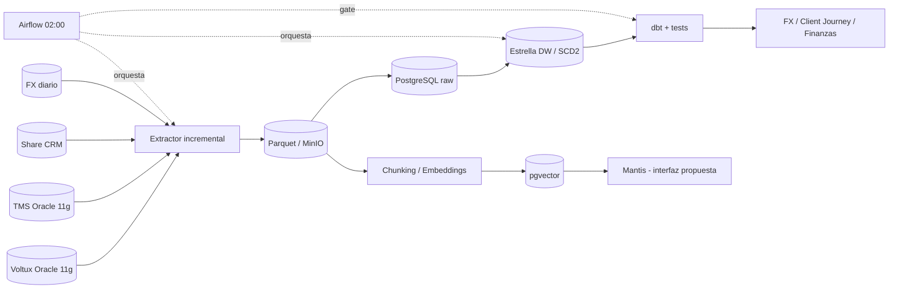
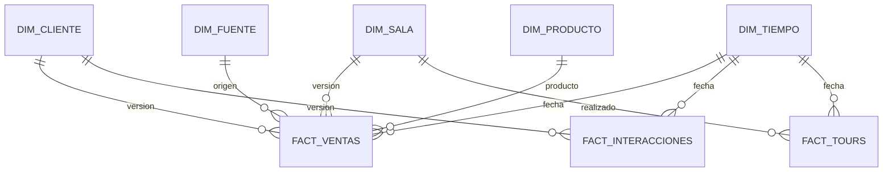
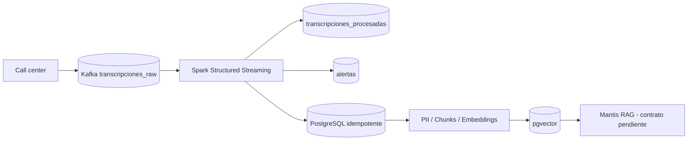

# Diagramas de arquitectura (GitHub Mermaid)

## Lakehouse por perfiles

```mermaid
flowchart LR
    VOL[(Voltux Oracle 11g)] --> EX[Extractor incremental]
    TMS[(TMS Oracle 11g)] --> EX
    SHARE[(Share CRM)] --> EX
    FX[(FX diario)] --> EX
    EX --> LAKE[(Parquet / MinIO)]
    LAKE --> RAW[(PostgreSQL raw)]
    RAW --> DW[(Estrella DW / SCD2)]
    DW --> DBT[dbt + tests]
    DBT --> BI[FX / Client Journey / Finanzas]
    LAKE --> RAG[Chunking / Embeddings]
    RAG --> VEC[(pgvector)]
    VEC --> MANTIS[Mantis - interfaz propuesta]
    AIR[Airflow 02:00] -. orquesta .-> EX
    AIR -. orquesta .-> DW
    AIR -. gate .-> DBT
```

## Diagrama dimensional simplificado

```mermaid
erDiagram
    DIM_CLIENTE ||--o{ FACT_VENTAS : version
    DIM_SALA ||--o{ FACT_VENTAS : version
    DIM_TIEMPO ||--o{ FACT_VENTAS : fecha
    DIM_FUENTE ||--o{ FACT_VENTAS : origen
    DIM_PRODUCTO ||--o{ FACT_VENTAS : producto
    DIM_CLIENTE ||--o{ FACT_INTERACCIONES : version
    DIM_TIEMPO ||--o{ FACT_INTERACCIONES : fecha
    DIM_SALA ||--o{ FACT_TOURS : realizado
    DIM_TIEMPO ||--o{ FACT_TOURS : fecha
```

## Streaming y Mantis

```mermaid
flowchart LR
  TEL[Call center] --> K[(Kafka transcripciones_raw)]
  K --> S[Spark Structured Streaming]
  S --> PROC[(transcripciones_procesadas)]
  S --> AL[(alertas)]
  S --> PG[(PostgreSQL idempotente)]
  PG --> EMB[PII / Chunks / Embeddings]
  EMB --> VEC[(pgvector)]
  VEC --> MANTIS[Mantis RAG - contrato pendiente]
```
